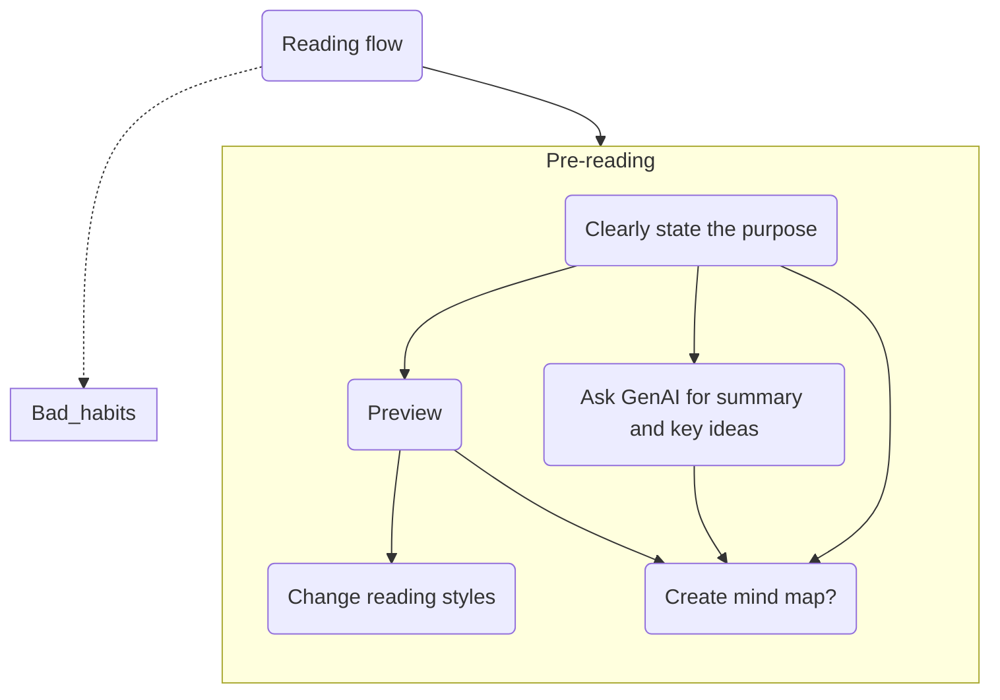

```mermaid
flowchart TB
    subgraph Pre-reading
        direction TB
        P1(Clearly state the purpose) --> P2(Preview)
        P2 --> P3(Change reading styles)
        P1 --> P4(Ask GenAI for summary and key ideas)
        P1 --> P5(Create mind map?)
        P2 --> P5
        P4 --> P5
    end
    subgraph Bad_habits
        direction TB
    end
    A(Reading flow) --> Pre-reading
    A -.-> Bad_habits
```
