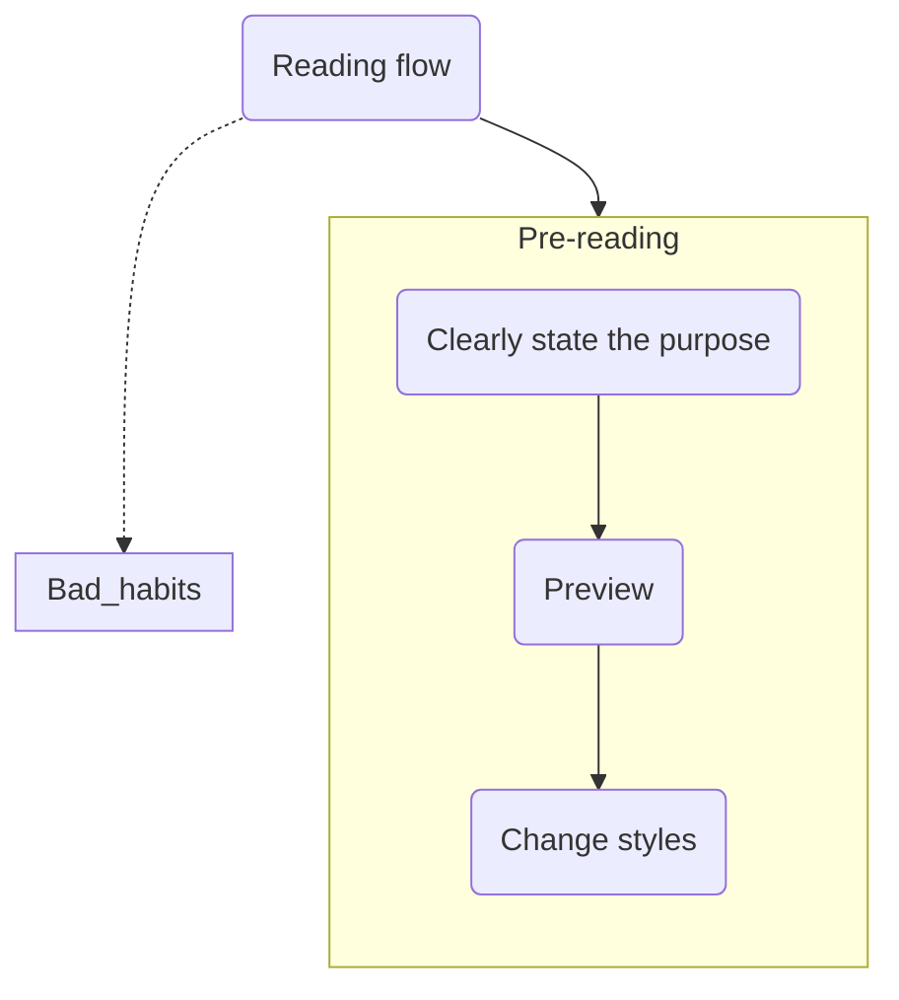

```mermaid
flowchart TB
    subgraph Pre-reading
        direction TB
        B(Clearly state the purpose) --> C(Preview)
        C --> D(Change styles)
    end
    subgraph Bad_habits
        direction TB
    end
    A(Reading flow) --> Pre-reading
    A -.-> Bad_habits
```