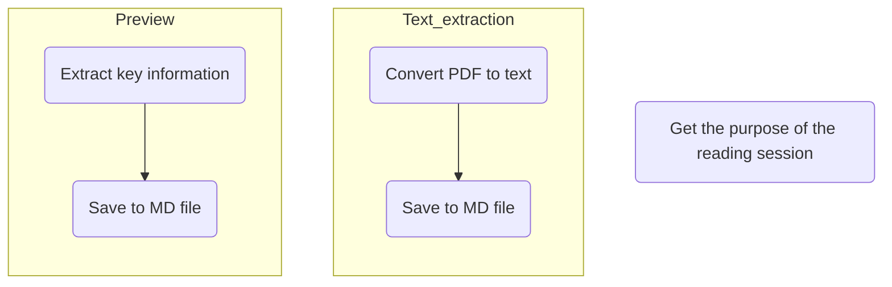

```mermaid
flowchart TB
    A(Get the purpose of the reading session)
    subgraph Text_extraction
        direction TB
        T1(Convert PDF to text) --> T2(Save to MD file)
    end
    subgraph Preview
        direction TB
        P1(Extract key information) --> P2(Save to MD file)
    end

```
