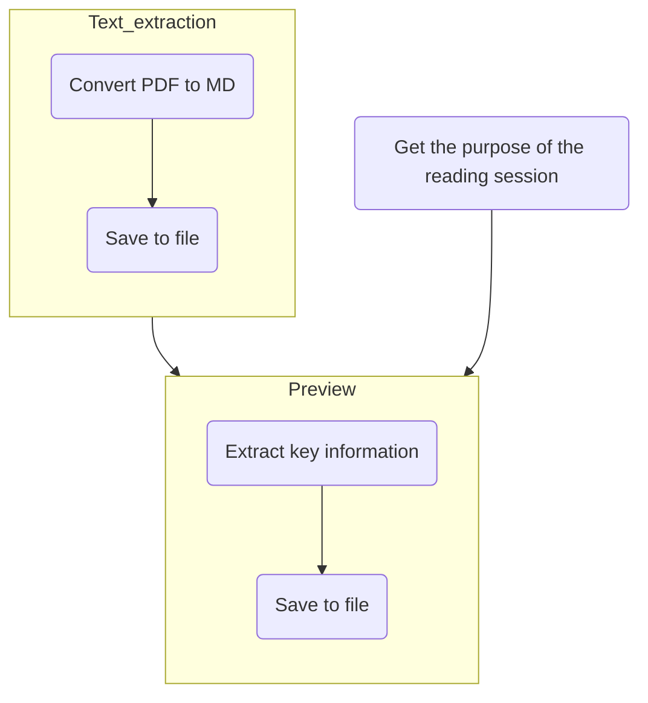

```mermaid
flowchart TB
    A(Get the purpose of the reading session)
    subgraph Text_extraction
        direction TB
        T1(Convert PDF to MD) --> T2(Save to file)
    end
    subgraph Preview
        direction TB
        P1(Extract key information) --> P2(Save to file)
    end
    Text_extraction --> Preview
    A --> Preview
```
